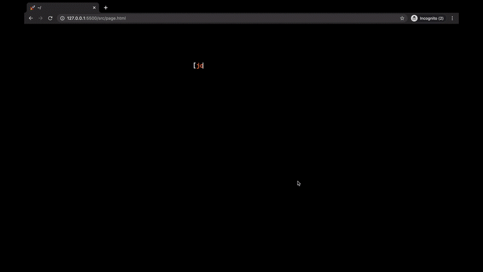
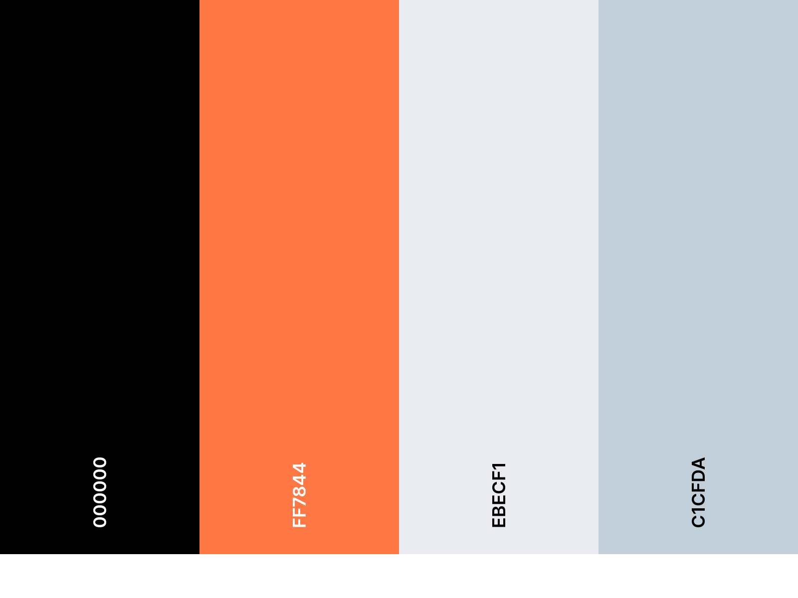

<h1 align="center"> $ tree -a  🚀</h1>

 Jarvis is a simple startup page that mimics the tree command. This startup page links to my most used websites. Refer to my [dotfiles](https://github.com/loej/dotfiles) for my implementation. For the live version visit: joelcs.com/Jarvis

## Preview  

  

## To do
+ [X] Choose final color palette
+ [X] Complete left tree side 
+ [X] Implement interactive web search

